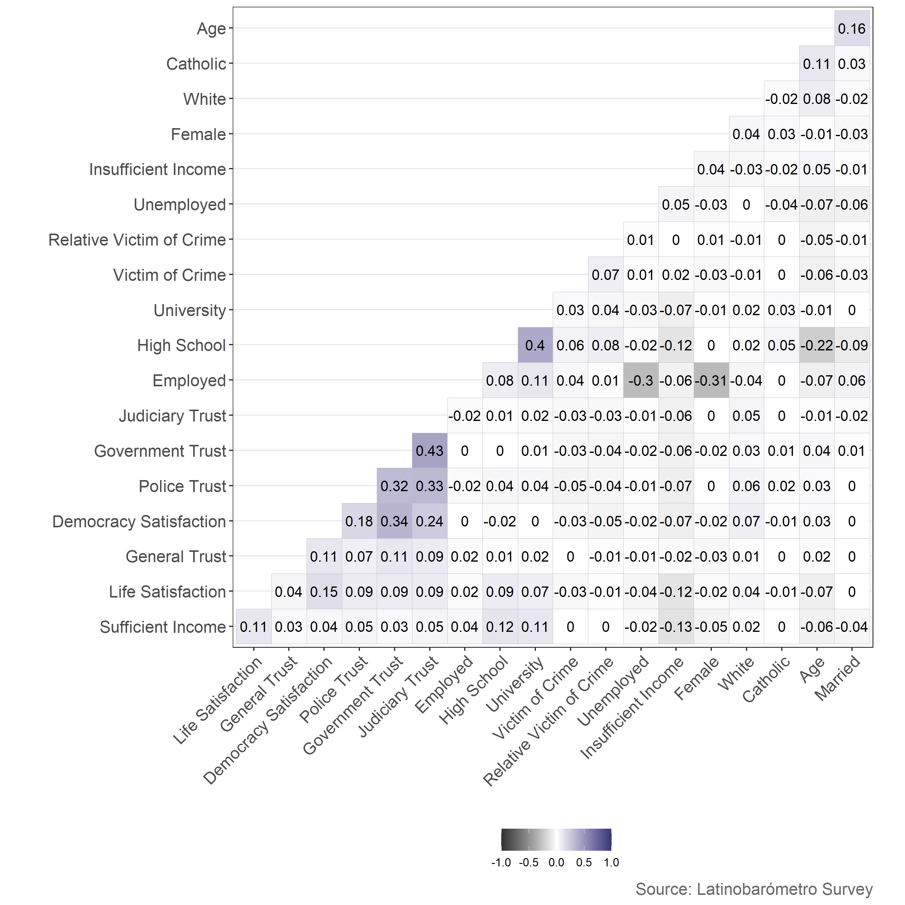
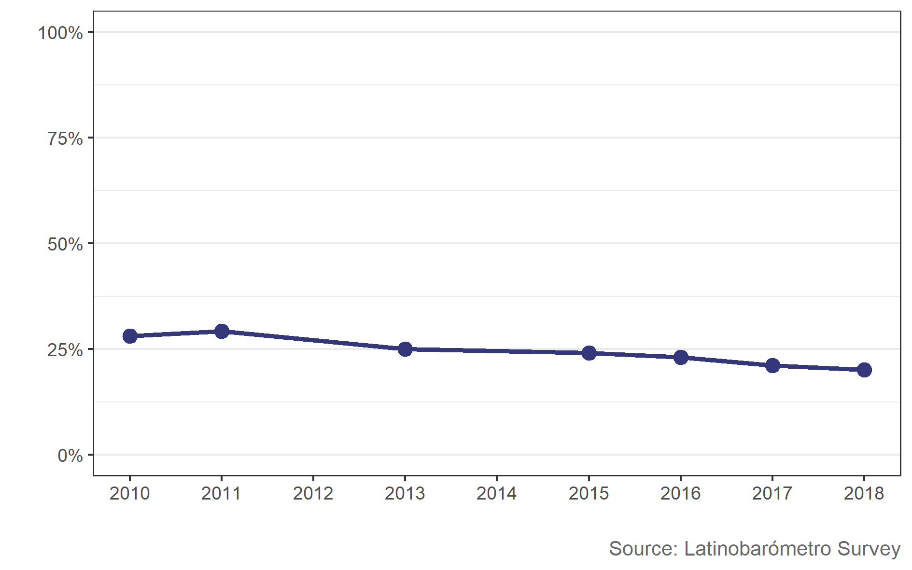
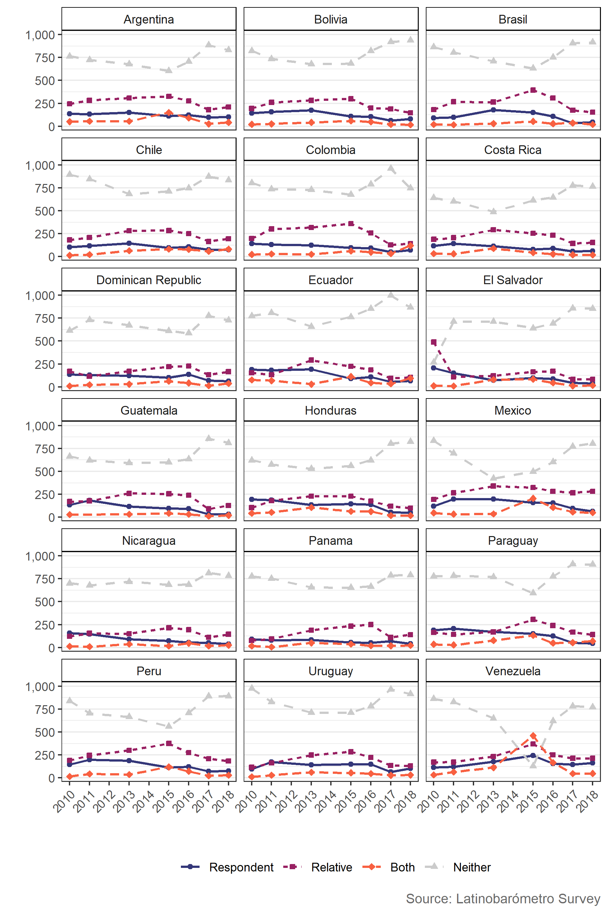

# Bachelor Thesis: Crime victimization and trust in the police in Latin America.
Research shows that social capital fuels economic growth in developing countries with weak institutions (Ahlerup et al., 2009). Social capital is widely acknowledged as the relationship between individuals. More specifically, Putnam (2000) defines social capital as “social networks and norms of reciprocity and trustworthiness” from social connections (p. 19). Existing literature reveals that crime can lower social capital not only through the occurrence itself but also may indirectly decrease social capital by reducing a victim’s trust in the police and other institutions (L. R. Blanco, 2013; Corbacho et al., 2015; Pazzona, 2020). Thus, studying the relationship between crime victimization and trust in institutions remains valuable, especially for countries with less developed economies, such as those in Latin America.

Thus, this thesis examines the effect of crime victimization on trust in the police in Latin America by calculating directional effects, marginal effects, and predicted probabilities. I further extend the study by analyzing the effect of crime victimization on trust in other institutions such as democracy, the government, and the judiciary. Although the regression model incorporates many control variables, it likely fails to correct for all types of bias such as omitted variable bias. Nevertheless, findings of this thesis still provide meaningful insight about how crime can erode social capital by lowering the probability of trusting institutions of crime victims. This current study contributes to the previous literature by using more recent data from a survey not widely used for the exploration of crime victimization and trust in institutions. Additionally, the regression equation utilizes generalized trust as an independent variable, unlike past probit or logit models in existence. The results show significant negative directional effects of crime victimization on the probability of trusting the police and all other institutions. Furthermore, I find that crime victims are 4.7 percentage points less likely to trust the police on average than non-victims. Additionally, results show significant positive effects of general trust on the probability of trusting the police, democracy, the government, and the judiciary.

## Probit Model Correlation Plot

This figure confirms that this study does not suffer from multicollinearity. As illustrated in the figure, no high correlations exist between independent variables.

    

Crime Index Rates</h2>

Latin American countries possess some of the highest crime rates in the world, measured by the World Bank’s 0–30 crime index. Several crime index values from Latin American countries largely surpass the world median of approximately 1.5, indicating that crime is tremendously problematic (World-Bank, 2017). 

    

The Most Important National Problem</h2>

Between 2010 and 2018, about one quarter of the Latinobarómetro survey respondents perceived crime as the most important national problem (Latinobarómetro, 2010-2018). Although there has been a slight decline over the years, as depicted in the following figure, the percentage remains fairly consistent.

    

Total Victimization</h2>

This figure shows the composition of victimization in the survey sample. Relative victimization occurred most commonly, followed by individual victimization, and then by respondents who experienced both relative and individual victimization. This trend stays consistent for all years, 2010 through 2018

    

Trust in Insitutions</h2>

This figure shows the percentage of survey respondents who trust the police, the judiciary, the government, and democracy between 2010 and 2018.

    

Type of Crime Victimization by Country</h2>

This figure shows the distribution of different types of crime victimization by country and year. Years 2008 and 2009 appear significantly different, indicating that the survey question or data collection method must have chaneged. Thus, this study excludes years 2008 and 2009.

    

Crime Victimization by Country</h2>

This figure shows crime victimization by country over time.

    

References</h2>

Ahlerup, P., Olsson, O., & Yanagizawa, D. (2009). Social capital vs institutions in the growth process. European Journal of Political Economy, 25(1), 1–14. https://doi.org/10.1016/j.ejpoleco.2008.09.008

Blanco, L. R. (2013). The impact of crime on trust in institutions in mexico. European Journal of Political Economy, 32, 38–55. https://doi.org/10.1016/j.ejpoleco.2013.06.004

Corbacho, A., Philipp, J., & Ruiz-Vega, M. (2015). Crime and erosion of trust: Evidence for latin america. World Development, 70, 400–415. https://doi.org/10.1016/j. worlddev.2014.04.013

Latinobarómetro Corporation. (2008–2018). *Latinobarómetro* [Dataset]. https://www.latinobarometro.org/latContents.jsp

Pazzona, M. (2020). Do victims of crime trust less but participate more in social organizations? Economics of Governance, 21(1), 49–73. https://doi.org/10.1007/s10101019-00227-1

Putnam, R. (2000). Bowling alone: The collapse and revival of american community.

World-Bank. (2017). Crime and theft [Dataset]. https://tcdata360.worldbank.org/indicators/mpf.cri.the?country=BRA&indicator=3284&viz=choropleth&years=2017